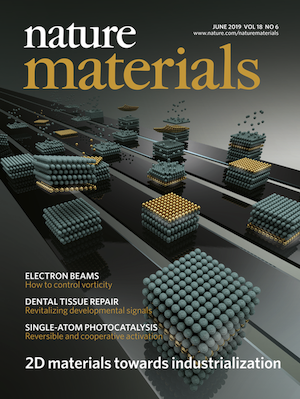
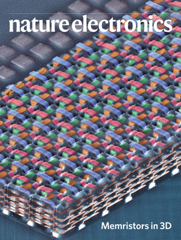

> some artworks designed by me

  
*an artificial synapse*  
Table of contents image for [*Nature Materials*](https://www.nature.com/articles/s41563-017-0001-5), 2018  

  
*optical image of a silicon sample with arrays of 2D material based devices*  
News image for [*MIT news*](http://news.mit.edu/2018/researchers-quickly-harvest-single-atom-materials-1011), 2018  

  
*assemble 2D-3D heterostructures on pipelines*  
Cover image for [*Nature Materials*](https://www.nature.com/nmat/volumes/18/issues/6), vol 18, issue 6, 2019   

  
*false colored SEM image of a 3D memristor array*  
Cover image for [*Nature Electronics*](https://www.nature.com/natelectron/volumes/3/issues/4), vol 3, issue 4, 2020

