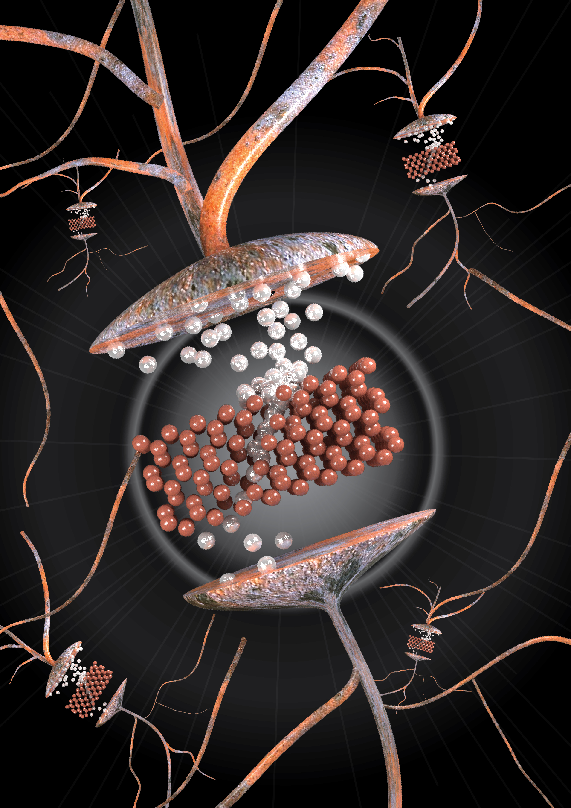
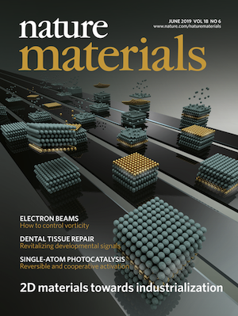
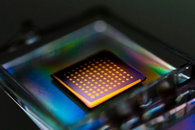

> some artworks designed by me

Table of contents image for [*Nature Materials*](https://www.nature.com/articles/s41563-017-0001-5), 2018
*an artificial synapse*

Cover image for [*Nature Materials*](https://www.nature.com/articles/s41563-019-0335-2), 2018
*producing 2D materials on pipelines*

News image for [*MIT news*](http://news.mit.edu/2018/researchers-quickly-harvest-single-atom-materials-1011), 2019
*optical image of a silicon sample with arrays of 2D devices*

Cover image for [*Nature Electronics*], *in press*
*false color scanning electron microscope image of a 3D array*